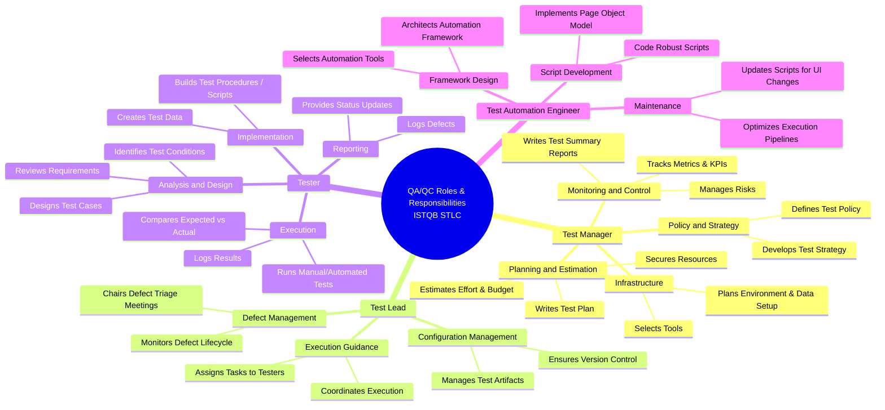

```mermaid
mindmap
  root((QA/QC Roles & Responsibilities<br>ISTQB STLC))
    Test Manager
      ::icon(fa fa-user-tie)
      Policy and Strategy
        Defines Test Policy
        Develops Test Strategy
      Planning and Estimation
        Writes Test Plan
        Estimates Effort & Budget
        Secures Resources
      Monitoring and Control
        Tracks Metrics & KPIs
        Writes Test Summary Reports
        Manages Risks
      Infrastructure
        Selects Tools
        Plans Environment & Data Setup
    Test Lead
      ::icon(fa fa-users)
      Execution Guidance
        Coordinates Execution
        Assigns Tasks to Testers
      Configuration Management
        Ensures Version Control
        Manages Test Artifacts
      Defect Management
        Chairs Defect Triage Meetings
        Monitors Defect Lifecycle
    Tester
      ::icon(fa fa-user-gear)
      Analysis and Design
        Reviews Requirements
        Identifies Test Conditions
        Designs Test Cases
      Implementation
        Creates Test Data
        Builds Test Procedures / Scripts
      Execution
        Runs Manual/Automated Tests
        Logs Results
        Compares Expected vs Actual
      Reporting
        Logs Defects
        Provides Status Updates
    Test Automation Engineer
      ::icon(fa fa-code)
      Framework Design
        Selects Automation Tools
        Architects Automation Framework
      Script Development
        Code Robust Scripts
        Implements Page Object Model
      Maintenance
        Updates Scripts for UI Changes
        Optimizes Execution Pipelines
```