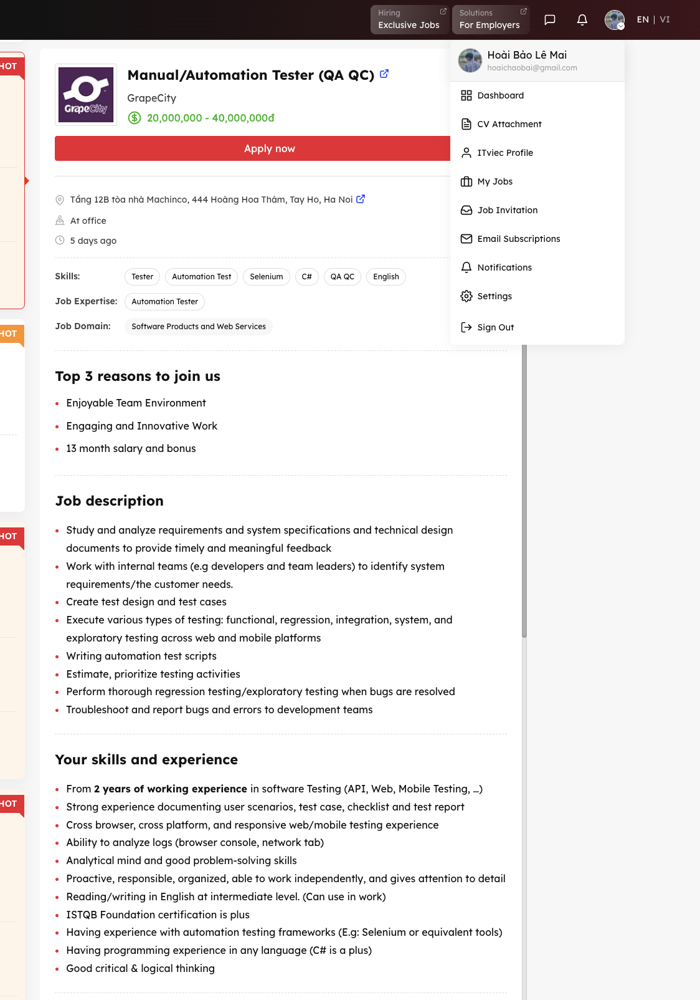
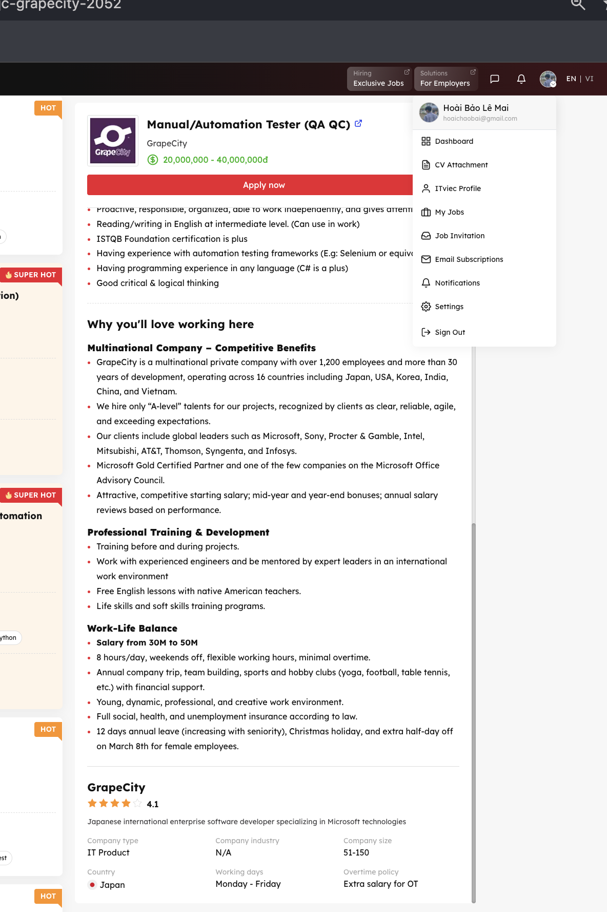
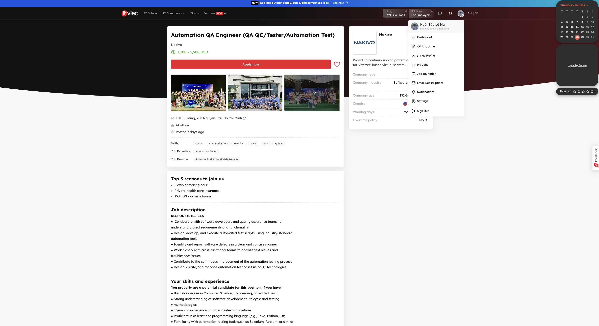
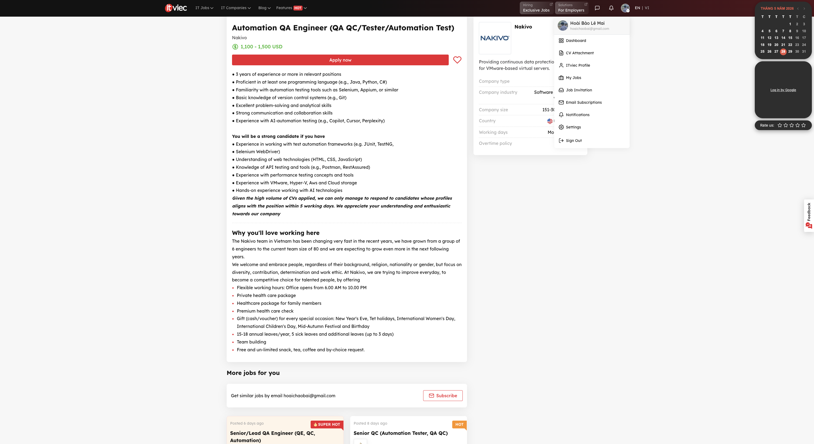
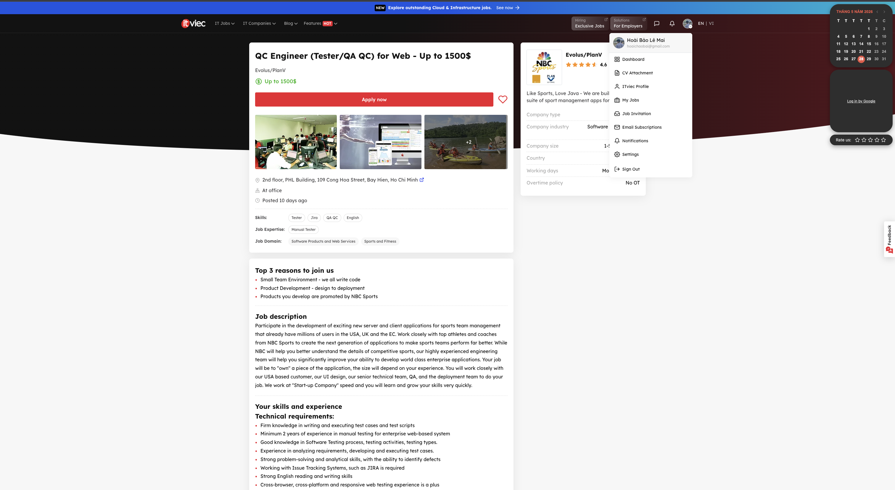
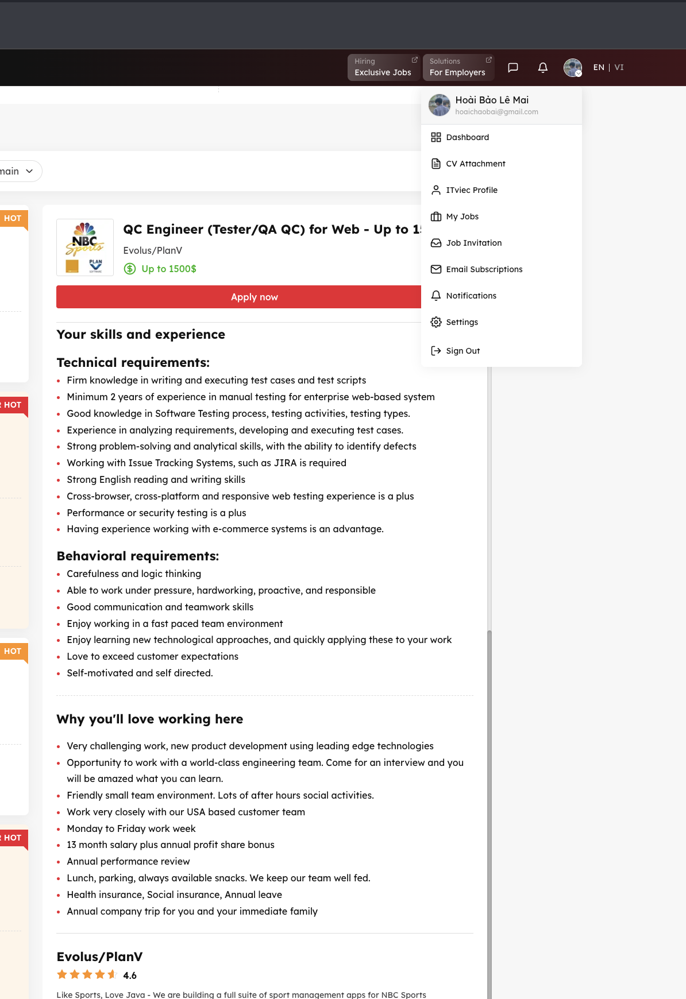
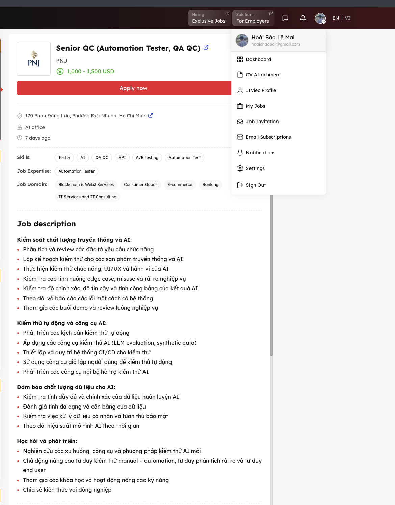
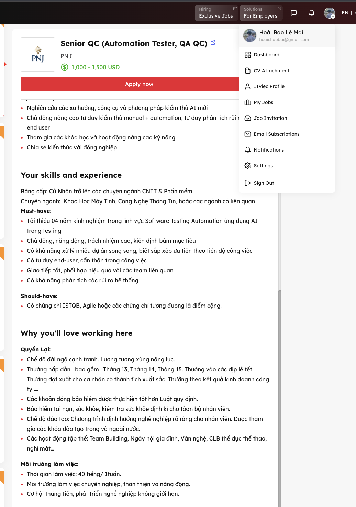

# Homework 1 Report
## General Information

- **Course:** Software Testing
- **Instructors:** 
  - Trần Duy Hoàng
  - Hồ Tuấn Thanh
  - Trương Phước Lộc

## Student Information

- **Name:** Lê Mai Hoài Bảo
- **Student ID:** 23127326

## Requirement 1 – QA/QC Job Market 2026+

### Job 1: Manual/Automation Tester (QA QC)

- **Link:** [Manual & Automation Tester (QA/QC)](https://itviec.com/it-jobs/qa-qc?job_selected=manual-automation-tester-qa-qc-grapecity-2052)

- **Screenshot:**

- **Job description:**

    - Study and analyze requirements and system specifications and technical design documents to provide timely and meaningful feedback
    - Work with internal teams (e.g developers and team leaders) to identify system requirements/the customer needs.
    - Create test design and test cases
    - Execute various types of testing: functional, regression, integration, system, and exploratory testing across web and mobile platforms
    - Writing automation test scripts
    - Estimate, prioritize testing activities
    - Perform thorough regression testing/exploratory testing when bugs are resolved
    - Troubleshoot and report bugs and errors to development teams

- **Required skill:**

    - From 2 years of working experience in software Testing (API, Web, Mobile Testing, …) 
    - Strong experience documenting user scenarios, test case, checklist and test report
    - Cross browser, cross platform, and responsive web/mobile testing experience
    - Ability to analyze logs (browser console, network tab)
    - Analytical mind and good problem-solving skills
    - Proactive, responsible, organized, able to work independently, and gives attention to detail
    - Reading/writing in English at intermediate level. (Can use in work)
    - ISTQB Foundation certification is plus
    - Having experience with automation testing frameworks (E.g: Selenium or equivalent tools)
    - Having programming experience in any language (C# is a plus) 
    - Good critical & logical thinking

- **Salary:** 20.000.000VNĐ - 40.000.000VNĐ

- **AI impact analysis:** This QA role combines both manual and automation testing, which is becoming more common in the software industry. AI can help testers save time by supporting test script generation and analyzing logs. However, testers are still needed to understand requirements and perform exploratory testing because some problems cannot be detected by AI alone.

### Job 2: Automation QA Engineer (QA QC/Tester/Automation Test)

- **Link:** [Automation QA Engineer (QA QC/Tester/Automation Test)](https://itviec.com/it-jobs/qa-qc?job_selected=automation-qa-engineer-qa-qc-tester-automation-test-nakivo-0115)

- **Screenshot:**

- **Job description:**

    - Collaborate with software developers and quality assurance teams to understand project requirements and functionality
    - Design, develop, and execute automated test scripts using industry-standard automation tools
    - Identify and report software defects in a clear and concise manner
    - Work closely with cross-functional teams to analyze test results and troubleshoot issues
    - Contribute to the continuous improvement of the automation testing process
    - Design, create, and manage automation test cases using AI technologies

- **Required skill:**

    - Core / Mandatory Requirements:
        - Bachelor's degree in Computer Science, Engineering, or a related field.
        - Strong understanding of the software development life cycle (SDLC) and testing methodologies.
        - 3 years of experience or more in relevant positions.
        - Proficient in at least one programming language (e.g., Java, Python, C#).
        - Familiarity with automation testing tools such as Selenium, Appium, or similar.
        - Basic knowledge of version control systems (e.g., Git).
        - Excellent problem-solving and analytical skills.
        - Strong communication and collaboration skills.
        - Experience with AI-automation testing (e.g., Copilot, Cursor, Perplexity).
    - Preferred / Strong Candidate Pluses:
        - Experience working with test automation frameworks (e.g., JUnit, TestNG, Selenium WebDriver).
        - Understanding of web technologies (HTML, CSS, JavaScript).
        - Knowledge of API testing and tools (e.g., Postman, RestAssured).
        - Experience with performance testing concepts and tools.
        - Experience with VMware, Hyper-V, AWS, and Cloud storage.
        - Hands-on experience working with AI technologies.

- **Salary:** 1,100 - 1,500 USD

- **AI impact analysis:** This job directly demands proficiency in AI-assisted testing tools like Copilot and Cursor, proving that AI literacy is now a core requirement in 2026 rather than just an optional skill. AI changes this role by automating code snippets for test scripts, yet the demand for strong architectural knowledge in cloud testing (AWS, VMware) ensures humans remain key decision-makers.

### Job 3: QC Engineer (Tester/QA QC) for Web - Up to 1500$

- **Link:** [QC Engineer (Tester/QA QC) for Web - Up to 1500$](https://itviec.com/it-jobs/qa-qc?job_selected=qc-engineer-tester-qa-qc-for-web-up-to-1500-evolus-planv-5225)

- **Screenshot:** 

- **Job description:**

    Participate in the development of exciting new server and client applications for sports team management that already have millions of users in the USA, UK and the EC. Work closely with top athletes and coaches from NBC Sports to create the next generation of applications to make sports teams perform far better. While NBC will help you better understand the details of competitive sports, our highly experienced engineering team will help you significantly improve your ability to develop world class enterprise applications. Your job will be to "own" a piece of the application, the size will depend on your experience. You will work closely with our USA based customer, our UI design, our senior technical team, QA, and the deployment team to do your job. We work at "Start-up Company" speed and you will learn and grow your skills very quickly.

- **Required skill:**

    - Technical requirements:
        - Firm knowledge in writing and executing test cases and test scripts
        - Minimum 2 years of experience in manual testing for enterprise web-based system
        - Good knowledge in Software Testing process, testing activities, testing types.
        - Experience in analyzing requirements, developing and executing test cases.
        - Strong problem-solving and analytical skills, with the ability to identify defects
        - Working with Issue Tracking Systems, such as JIRA is required
        - Strong English reading and writing skills
        - Cross-browser, cross-platform and responsive web testing experience is a plus
        - Performance or security testing is a plus
        - Having experience working with e-commerce systems is an advantage.
    - Behavioral requirements:
        - Carefulness and logic thinking
        - Able to work under pressure, hardworking, proactive, and responsible
        - Good communication and teamwork skills
        - Enjoy working in a fast paced team environment
        - Enjoy learning new technological approaches, and quickly applying these to your work
        - Love to exceed customer expectations
        - Self-motivated and self directed.

- **Salary:** Up to 1500%

- **AI impact analysis:** AI-powered testing tools (like self-healing test scripts and automated defect detection) are automating repetitive manual test cases, shrinking the core of this role. However, QAs who can leverage AI to design smarter test strategies, interpret results, and validate AI-generated features will remain essential — shifting the skill bar rather than eliminating the position.

### Job 4: Senior QC (Automation Tester, QA QC)

- **Link:** [Senior QC (Automation Tester, QA QC)](https://itviec.com/it-jobs/qa?job_selected=senior-qc-automation-tester-qa-qc-pnj-5542)

- **Screenshot:**

- **Job description:**

    - Kiểm soát chất lượng truyền thống và AI:
        - Phân tích và review các đặc tả yêu cầu chức năng
        - Lập kế hoạch kiểm thử cho các sản phẩm truyền thống và AI
        - Thực hiện kiểm thử chức năng, UI/UX và hành vi của AI
        - Kiểm tra các tình huống edge case, misuse và rủi ro nghiệp vụ
        - Kiểm tra độ chính xác, độ tin cậy và tính công bằng của kết quả AI
        - Theo dõi và báo cáo các lỗi một cách có hệ thống
        - Tham gia các buổi demo và review luồng nghiệp vụ
    - Kiểm thử tự động và công cụ AI:
        - Phát triển các kịch bản kiểm thử tự động
        - Áp dụng các công cụ kiểm thử AI (LLM evaluation, synthetic data)
        - Thiết lập và duy trì hệ thống CI/CD cho kiểm thử
        - Sử dụng công cụ giả lập người dùng để kiểm thử tự động
        - Phát triển các công cụ nội bộ hỗ trợ kiểm thử AI 
    - Đảm bảo chất lượng dữ liệu cho AI:
        - Kiểm tra tính đầy đủ và chính xác của dữ liệu huấn luyện AI
        - Đánh giá tính đa dạng và cân bằng của dữ liệu
        - Kiểm tra việc xử lý dữ liệu cá nhân và tuân thủ bảo mật
        - Theo dõi hiệu suất mô hình AI theo thời gian
    - Học hỏi và phát triển:
        - Nghiên cứu các xu hướng, công cụ và phương pháp kiểm thử AI mới
        - Chủ động nâng cao tư duy kiểm thử manual + automation, tư duy phân tích rủi ro và tư duy end user
        - Tham gia các khóa học và hoạt động nâng cao kỹ năng
        - Chia sẻ kiến thức với đồng nghiệp

- **Required skill:**

    - Bằng cấp: Cử Nhân trở lên các chuyên ngành CNTT & Phần mềm
    - Chuyên ngành: Khoa Học Máy Tính, Công Nghệ Thông Tin, hoặc các ngành có liên quan
    - Must-have: 
        - Tối thiểu 04 năm kinh nghiệm trong lĩnh vực Software Testing Automation ứng dụng AI trong testing
        - Chủ động, năng động, trách nhiệm cao, kiên định bám mục tiêu
        - Có khả năng xử lý nhiều dự án song song, biết sắp xếp ưu tiên theo tiến độ công việc
        - Có tư duy end-user, cẩn thận trong công việc
        - Giao tiếp tốt, phối hợp hiệu quả với các team liên quan.
        - Có khả năng phân tích các rủi ro hệ thống
    - Should-have: 
        - Có chứng chỉ ISTQB, Agile hoặc các chứng chỉ tương đương là điểm cộng.

- **Salary:** 1,000 - 1,500 USD

- **AI impact analysis:** The job description reflects AI's dual role: AI is simultaneously the product being tested (LLM evaluation, model behavior, fairness, training data quality) and the tool accelerating the work (automated testing, synthetic data generation, CI/CD pipelines). This means the QA engineer must evolve from a traditional tester into an AI-literate quality analyst who understands both how to test AI systems and how to leverage AI to test faster and smarter.