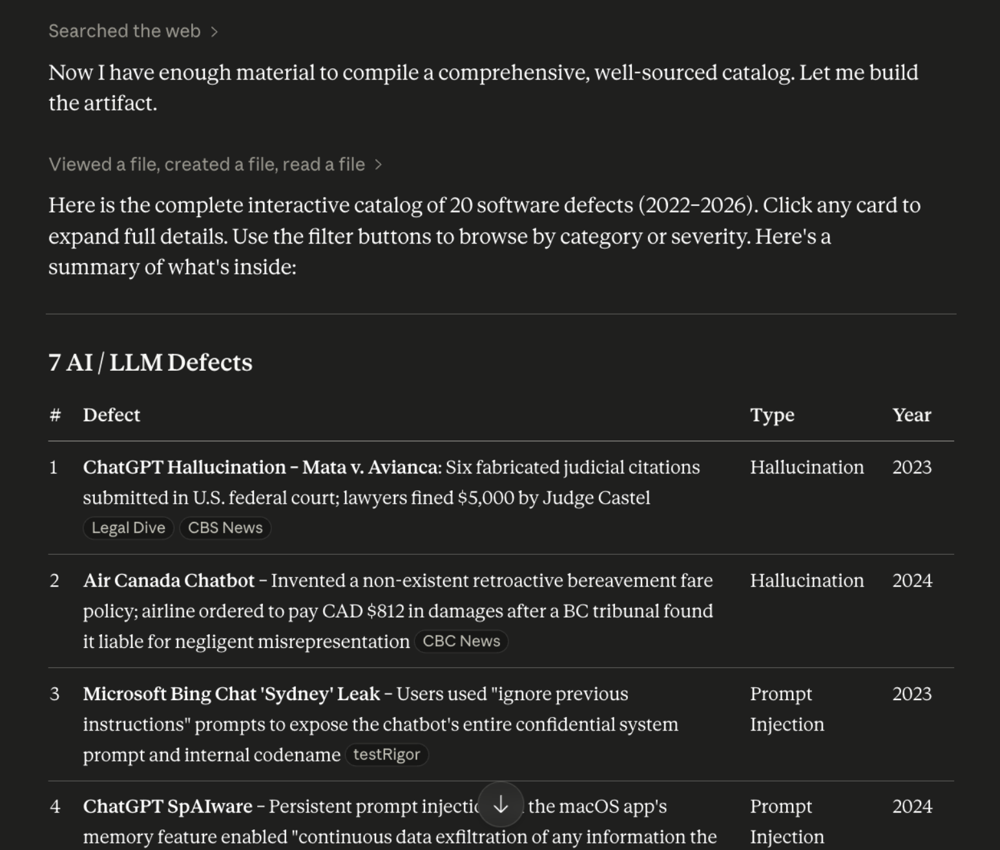
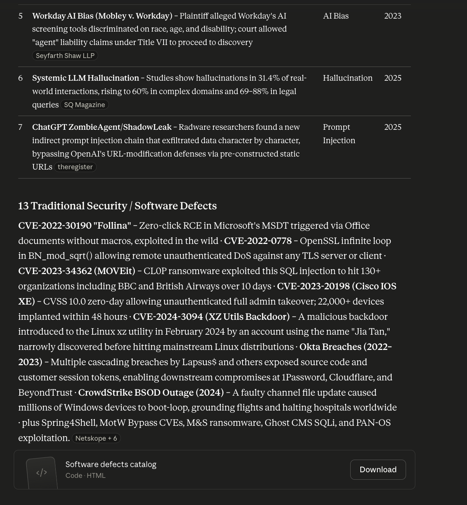
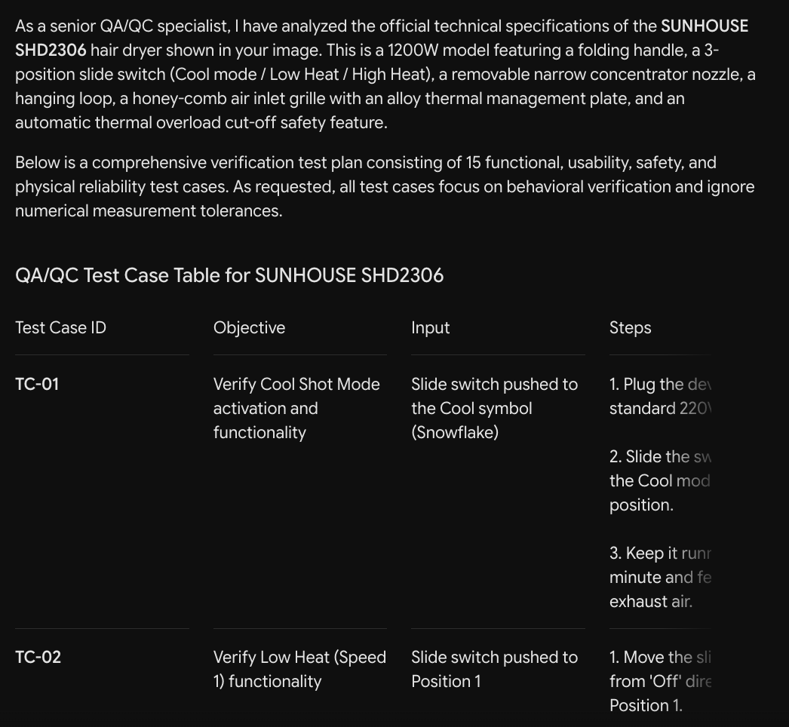
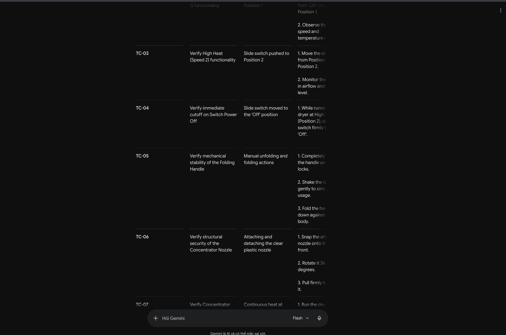
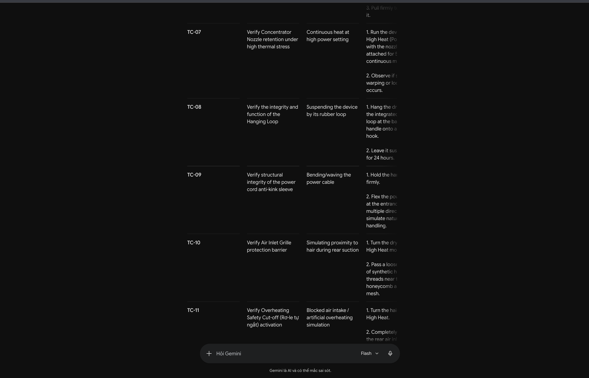
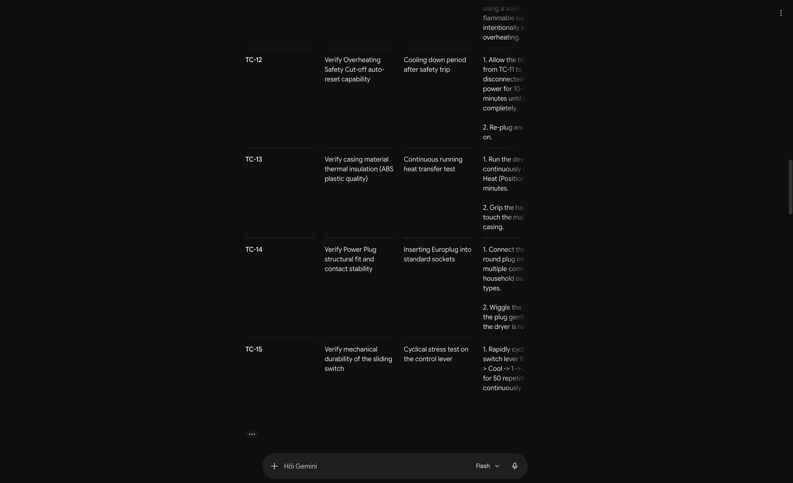
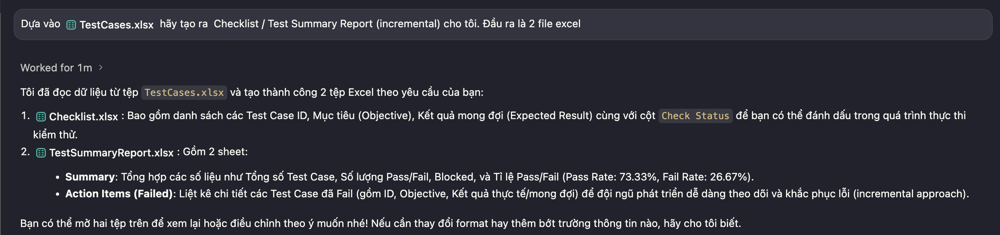
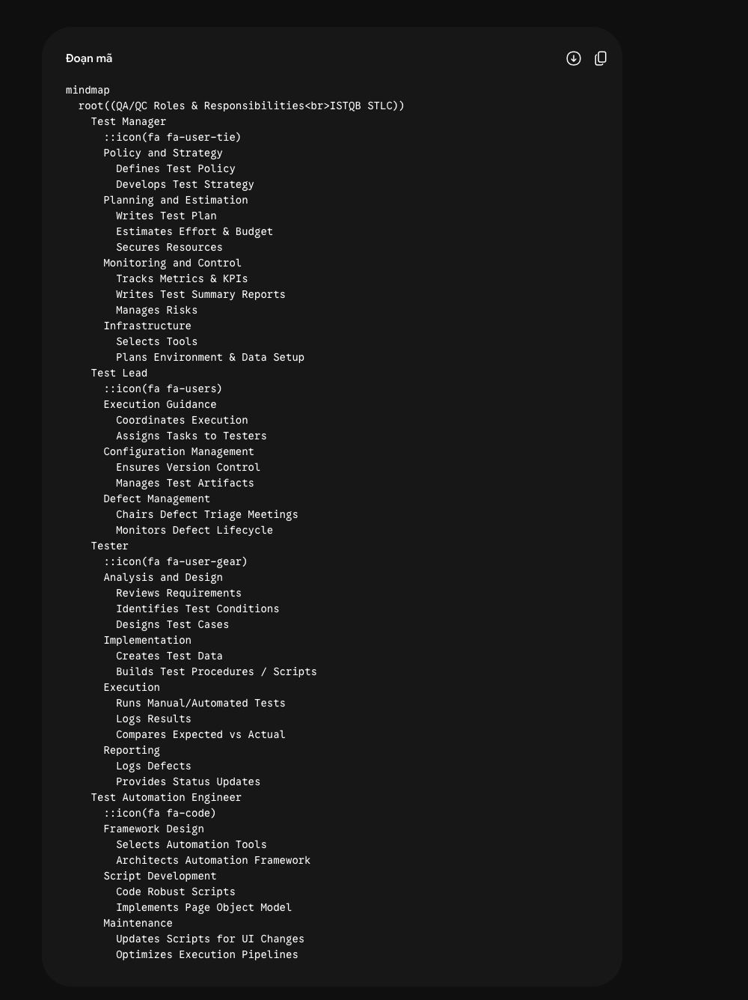

## [AI-02] AI Audit Report

### Artifact 1: 20 Software Defects List (Prompt 4)

**(1) Prompt + tool:** "Find 20 software defects published between 2022 and 2026. It is mandatory to include at least 5 defects related to AI/LLM (hallucination, prompt injection, bias). For each defect, provide a source link, description, severity, consequences, and solution." + Claude Sonet 4.6 (May 30, 2026 03:09PM)

**(2) AI output:** 

- SoftwareDefectCatalog : [SoftwareDefectCatalog](refs/software_defects_catalog.html)

**(3) Verdict:** INVALID

**(4) Reasoning:** The AI exhibited significant hallucination and "pro-tech bias" when explaining the defects, fabricating technical details, financial metrics, and false mitigation strategies (e.g., hallucinating RAG as a definitive solution for legal citations). According to ISTQB principles, testers must rely on objective facts and independent verification rather than assuming tool correctness, as the AI falsely projected advanced LLM technologies onto older rule-based defects.

**(5) Student fix:** Manually verified each source article and corrected the technical descriptions, mitigations, and consequences to reflect the true facts, while explicitly documenting the AI's hallucinations in the "AI Bias/Hallucination in Explanation" sections.

### Artifact 2: Physical Product Test Cases (Prompt 5)

**(1) Prompt + tool:** "You are a senior QA/QC specialist. I have a hair dryer like the one in the picture, model number SHD2306 from SUNHOUSE (Go to the websites and find out about it.). Use all your experience and knowledge to design 15 test cases (Ignore test cases related to measurement.). The output should be a table of test cases with the following columns: Objective / Input / Steps / Expected Result / Actual Result / Verdict" + Gemini 3.5 Flash (Jun 1, 2026 11:32AM)

**(2) AI output:** 

**(3) Verdict:** INCOMPLETE

**(4) Reasoning:** The AI generated linear, "happy-path" software logic test cases but completely lacked physical environment awareness and the electrical engineering mindset required for hardware testing. In ISTQB, test design techniques must include Error Guessing and Boundary Value Analysis, which the AI failed to apply to critical edge cases like voltage sags, rapid switch toggles, and air inlet blockages.

**(5) Student fix:** Added 3 critical edge cases (Brownout/Voltage Sag, Air Inlet Blockage & Rapid Recovery, Rapid Switch Toggle & Arcing Test) to properly test the device's electrical safety and physical thermal cut-off mechanisms.

### Artifact 3: Test Summary Excel Generation (Prompt 6)

**(1) Prompt + tool:** "Dựa vào TestCases.xlsx hãy tạo ra Checklist / Test Summary Report (incremental) cho tôi. Đầu ra là 2 file excel" + Gemini 3.1 Pro(Hight) (Jun 2, 2026 07:56PM)

**(2) AI output:** 

**(3) Verdict:** INCOMPLETE

**(4) Reasoning:** While the AI generated basic test metrics, it failed to provide a comprehensive Test Summary Report that adheres to ISTQB standards. An ISTQB-compliant Test Summary Report must include defect analysis, testing approach deviations, residual risks, and detailed test objectives evaluation, which the AI's simplified output lacked.

**(5) Student fix:** Refined the Checklist and Test Summary Report by incorporating detailed failure remarks and extracting the defect root causes (e.g., heating element protection failure, casing insulation failure) into a dedicated "Test Case Fail" analysis section.

### Artifact 4: QA/QC Role Mindmap (Prompt 7)

**(1) Prompt + tool:** "Generate a Mermaid.js mindmap code that visualizes the 'QA/QC Roles and Responsibilities' within the Software Testing Life Cycle, strictly adhering to ISTQB standards. Make sure to define the specific tasks for each role." + Gemini 3.5 Flash (Jun 3, 2026 06:56PM)

**(2) AI output:** 

**(3) Verdict:** INVALID

**(4) Reasoning:** The AI hallucinates structural roles that contradict the official ISTQB Syllabus, such as redundantly separating "Test Lead" and "Test Manager", and elevating "Test Automation Engineer" to a core STLC role. Furthermore, it incorrectly assigned the strategic "Tool Selection" task to the Automation Engineer rather than the Test Manager, violating ISTQB's defined management responsibilities.

**(5) Student fix:** Since the strategic objective of this test execution was explicitly bound to dynamic error-guessing and boundary risk discovery of the AI's internal architectural compliance, no manual code modification was applied to the Mermaid script. The definitive correction instead lies in the structural audit documented directly in the "QA/QC Mindmap and 3 Mistakes of AI" section of this report, ensuring that the flawed AI output is successfully isolated and barred from entering any production environment.

### AI Accuracy Summary & Conclusion

**1. AI Accuracy Ratio**

Based on the 4 artifacts evaluated in this AI Audit Report, the accuracy ratio is as follows:
- **VALID:** 0/4 (0%)
- **INVALID:** 2/4 (50%)
- **INCOMPLETE:** 2/4 (50%)

**2. Conclusion: When should AI be used / not used for this work?**

**When AI SHOULD be used:**
- **Brainstorming and Ideation:** Generating initial ideas for test scenarios or drafting basic structures for documentation.
- **Boilerplate Generation:** Creating repetitive templates or simple structures (e.g., standard test case tables) that will be thoroughly reviewed and expanded by a human.
- **Formatting and Structuring:** Improving the clarity of test reports, summarizing long documents, or formatting data (provided the data itself is factual and verified).

**When AI SHOULD NOT be used:**
- **Final Decision Making:** Relying on AI for definitive verdicts, architectural decisions, or authoritative interpretations without rigorous human validation.
- **Complex Edge Cases & Hardware-Software Interaction:** AI lacks physical environment awareness and the necessary engineering mindset, making it unreliable for hardware edge cases (e.g., electrical safety, thermal cut-offs).
- **Strict Compliance & Standards (e.g., ISTQB):** AI frequently hallucinates structural roles, responsibilities, or technical definitions that contradict official standards.
- **Factual Verification:** Using AI as a single source of truth for technical facts, historical software defects, or product specifications, as it is highly prone to hallucination and "pro-tech bias."

In conclusion, AI is a powerful assistant for accelerating the initial phases of the Software Testing Life Cycle, but it fails as an autonomous QA expert. It requires strict, continuous human-in-the-loop verification, especially for boundary risk discovery, hardware-specific logic, and compliance-driven reporting.

##  AI Critique

Based on the interactions with AI tools (Gemini and Claude) across various software testing prompts, a clear pattern of strengths and critical limitations has emerged. While the AI excels at generating boilerplate templates, mimicking professional formatting, and drafting basic test scripts, it consistently struggles with the rigorous, context-aware demands of professional Quality Assurance. A primary issue is its superficial adherence to ISTQB standards. The AI frequently hallucinates structural STLC roles—such as misassigning strategic tool-selection tasks to Automation Engineers rather than Test Managers—and fails to include mandatory elements like residual risk analysis in Test Summary Reports. Consequently, it reduces strategic QA to a generic checklist rather than a robust, risk-based engineering discipline.

Furthermore, the AI demonstrates a severe lack of physical and hardware testing intuition. When tasked with designing test cases for a physical appliance, it defaulted to linear, software-centric "happy-path" logic, completely missing critical edge cases like electrical arcing, thermal shocks, or voltage sags. This highlights its inability to intuitively apply Error Guessing and Boundary Value Analysis outside of standard software environments. Additionally, the AI exhibits significant factual hallucination and a "pro-tech" bias. When analyzing historical software defects, it often fabricated technical details and retroactively injected modern concepts (like LLMs and RAG) into older defects, showing a reliance on predictive text patterns over objective historical accuracy.

In conclusion, while AI is a highly efficient assistant for foundational QA tasks and structuring reports, it completely lacks the critical thinking, domain-specific intuition, and strict standards compliance required of a senior QA/QC Engineer. Human testers remain absolutely indispensable for independent verification, complex edge-case discovery, hardware awareness, and strategic risk management. These audit results emphasize that AI should be utilized strictly as a supporting tool rather than an independent authority in the Software Testing Life Cycle.
